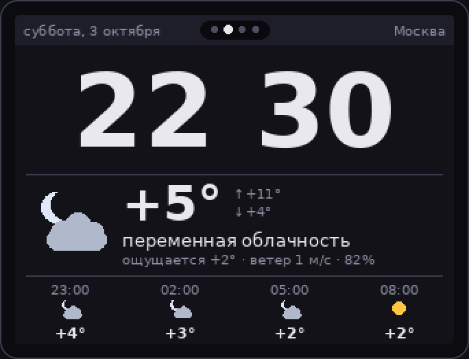
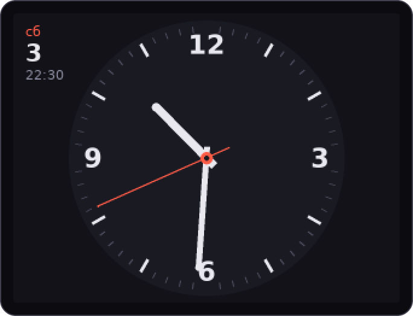
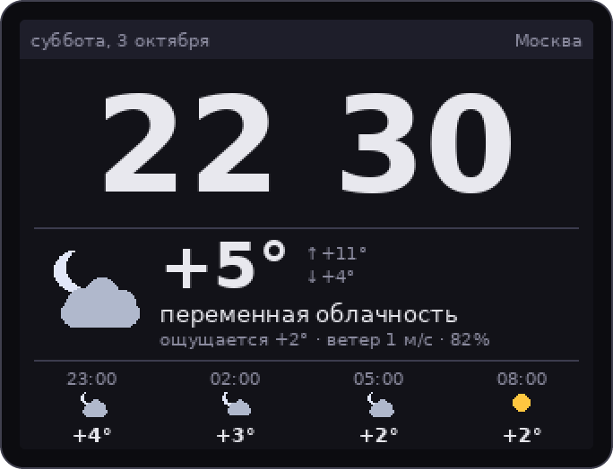
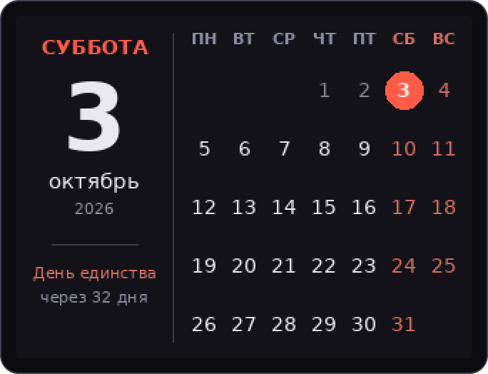
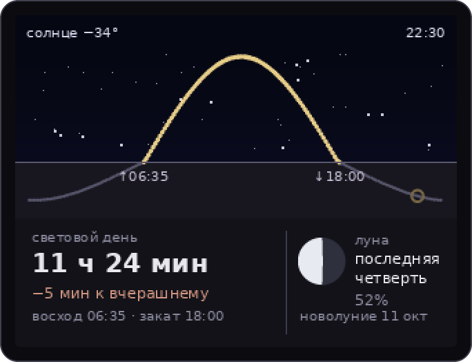
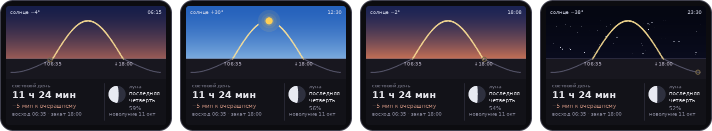

<h1 align="center">RoboPeak Mini USB Display — настольные часы</h1>

<p align="center">
  Крошечный USB-экран 320×240 с тачем превращается в настольные часы:<br>
  четыре страницы, которые листаются пальцем, как StandBy на лежащем телефоне.
</p>

<p align="center">
  
</p>

<p align="center">
  <a href="#быстрый-старт">Быстрый старт</a> ·
  <a href="#страницы">Страницы</a> ·
  <a href="#что-внутри">Что внутри</a> ·
  <a href="smartscreen/README.md">Подробно о часах</a> ·
  <a href="drivers/linux-driver/README.md">Драйвер</a>
</p>

---

## Страницы

```
стрелочные  ←  цифровые с погодой  →  календарь  →  небо
```

Панель стартует с цифровых часов в центре. Свайп вбок — соседняя страница,
касание цифровых часов — свежая погода.

<table>
  <tr>
    <td align="center" width="50%">
      <br>
      <b>Стрелочные</b><br>
      <sub>Сглаженные стрелки, секундная тикает каждую секунду; дата в углу</sub>
    </td>
    <td align="center" width="50%">
      <br>
      <b>Цифровые с погодой — дом</b><br>
      <sub>Сейчас, «ощущается», ветер, влажность и прогноз на ближайшие часы</sub>
    </td>
  </tr>
  <tr>
    <td align="center" width="50%">
      <br>
      <b>Календарь</b><br>
      <sub>Месяц, сегодня, выходные и праздники РФ, отсчёт до ближайшего</sub>
    </td>
    <td align="center" width="50%">
      <br>
      <b>Небо</b><br>
      <sub>Путь солнца за день, долгота дня, фаза луны</sub>
    </td>
  </tr>
</table>

### Небо в течение дня

Цвет неба следует за настоящей высотой солнца над горизонтом: синий днём,
тёплая полоса на рассвете и закате, звёзды ночью. Солнце стоит там, где оно
сейчас на самом деле. Всё считается локально по координатам, без сети.

<p align="center">
  
</p>

## Быстрый старт

Нужны Linux, Python 3 с Pillow и `dkms`. Проверено на Ubuntu 26.04 с ядром 7.0 и Pillow 12.

```sh
# 1. драйвер — DKMS сам пересоберёт его при обновлении ядра
sudo apt install dkms python3-pil fonts-dejavu-core
sudo drivers/linux-driver/dkms-install.sh
sudo modprobe rp_usbdisplay

# 2. доступ к экрану и тачу без root
sudo smartscreen/install-udev.sh

# 3. часы как служба
cp smartscreen/systemd/ccdisp-clock.service ~/.config/systemd/user/
systemctl --user enable --now ccdisp-clock
```

Город определяется по IP один раз и кэшируется. Задать его явно, отключить
секундную стрелку и прочее — в `~/.config/ccdisp/clock.json`, образец в
[`smartscreen/clock.example.json`](smartscreen/clock.example.json). Погода —
[Open-Meteo](https://open-meteo.com/): без ключей и регистрации.

> **Экран чёрный после обновления Ubuntu?** Скорее всего, ядро переставилось с
> той же строкой версии, и DKMS не пересобрал модуль. Рецепт — в разделе
> [«Если экран чёрный»](smartscreen/README.md#если-экран-чёрный).

## Что внутри

| | |
|---|---|
| [`smartscreen/`](smartscreen/README.md) | Часы: страницы, листалка, погода. Python и Pillow, без других зависимостей |
| [`drivers/linux-driver/`](drivers/linux-driver/README.md) | Драйвер ядра: framebuffer `rpusbdisp-fb` и тач `RoboPeakUSBDisplayTS`. Приведён к API ядер 6.x и 7.x |
| [`drivers/usermode-sdk/`](drivers/usermode-sdk) | SDK RoboPeak для Windows, macOS и Linux без драйвера ядра |
| [`drivers/Usb*`](drivers), [`docs/`](docs) | Драйверы Windows 11 (UMDF, Indirect Display, HID-тач) и их документация |
| [`docs/upstream-readme.md`](docs/upstream-readme.md) | Исходная инструкция RoboPeak: сборка в дереве ядра, кросс-компиляция, X11 |

**Устройство:** RoboPeak Mini USB Display, он же DFRobot DFR0275. Экран
320×240 RGB565, резистивный тач, USB 1.1 full speed, `fccf:a001`.

Скорость USB и задаёт характер интерфейса. Кадр уходит по USB не чаще 16 раз в
секунду, поэтому часы отправляют только изменившийся прямоугольник: мигание
двоеточия — 0,7 % экрана. Переход между страницами короткий и рассчитан по
времени, а не по числу кадров.

## Благодарности и лицензия

Оригинальный драйвер и SDK — [RoboPeak](https://github.com/robopeak/rpusbdisp)
(Shikai Chen). Код распространяется под [GPL-2.0](LICENSE).
